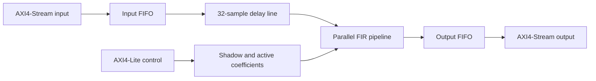

# 32-Tap Pipelined FIR Accelerator

A synthesizable fixed-point FIR accelerator with AXI4-Stream data interfaces,
AXI4-Lite coefficient programming, FIFO buffering, and a fully pipelined
parallel multiply-accumulate datapath.

## Highlights

* 32 signed 16-bit samples and coefficients
* 40-bit accumulator output
* 32 parallel multipliers and a five-level registered adder tree
* One-sample-per-cycle peak throughput
* Correct AXI4-Stream backpressure from output to input
* Input and output FIFOs with simultaneous push/pop support
* Shadow coefficient registers with atomic software-controlled commit
* Self-checking testbenches, including signed arithmetic and randomized output
  backpressure

## Architecture



The datapath computes

```text
y[n] = sum(k=0..31) h[k] * x[n-k]
```

The current input is used as `x[n]`; no artificial leading-zero output is
inserted. With no stalls, the DSP accepts one sample every clock. The result is
available at the output FIFO six clocks after the corresponding delay-line/DSP
transfer.

## Register Map

| Address     | Name       | Access | Description                                                        |
| ----------- | ---------- | ------ | ------------------------------------------------------------------ |
| `0x00`      | CONTROL    | R/W    | Bit 0 enables input processing                                     |
| `0x04`      | COEFF_LOAD | W      | Any write atomically copies shadow coefficients to the active bank |
| `0x08`      | STATUS     | R      | Bits 0–3: input full, input empty, output full, output empty       |
| `0x10 + 4k` | COEFF[k]   | R/W    | Signed coefficient shadow register, `k = 0..31`                    |

Software should write all desired shadow coefficients, write `COEFF_LOAD`, and
then enable the filter. Later shadow writes do not affect filtering until the
next load command.

## Source Files

| File             | Purpose                                    |
| ---------------- | ------------------------------------------ |
| `fir_top.v`      | Accelerator integration and delay line     |
| `fir_dsp.v`      | Pipelined multipliers and adder tree       |
| `axis_fifo.v`    | Parameterized ready/valid FIFO             |
| `fir_axi_lite.v` | Control, status, and coefficient registers |
| `tb_fir_top.v`   | End-to-end self-checking stress test       |
| `tb_fir_dsp.v`   | FIR datapath unit test                     |
| `tb_axis_fifo.v` | FIFO unit test                             |

## Simulation

Example with Icarus Verilog:

```bash
iverilog -g2012 -s tb_axis_fifo -o sim_fifo axis_fifo.v tb_axis_fifo.v
vvp sim_fifo

iverilog -g2012 -s tb_fir_dsp -o sim_dsp fir_dsp.v tb_fir_dsp.v
vvp sim_dsp

iverilog -g2012 -s tb_fir_top -o sim_top \
  axis_fifo.v fir_dsp.v fir_axi_lite.v fir_top.v tb_fir_top.v
vvp sim_top
```

## Implementation Notes

The arithmetic is two's-complement signed. `ACC_WIDTH` must be selected to
avoid overflow for the intended sample and coefficient ranges. The current
top-level datapath exposes 32 explicit sample ports to the DSP module, so
`NUM_TAPS=32` is the supported integrated configuration.

For a portfolio release, add the Vivado device and clock constraint used for
synthesis, then report post-synthesis/post-implementation LUT, FF, DSP, BRAM,
Fmax, and power results here. Those numbers are intentionally not claimed
without a reproducible implementation run.


## FPGA Implementation Results

The accelerator was implemented using Vivado 2025.2 for a Kintex-7
`xc7k70tfbv676-1`.

### Resource Utilization

| Resource | Used | Available | Utilization |
| --- | ---: | ---: | ---: |
| Slices | 1,029 | 10,250 | 10.04% |
| Slice LUTs | 1,900 | 41,000 | 4.63% |
| Flip-flops | 3,793 | 82,000 | 4.63% |
| DSP48E1 blocks | 32 | 240 | 13.33% |
| Block RAM tiles | 0 | 135 | 0.00% |

All 32 signed multipliers were mapped to dedicated DSP48E1 blocks. The small
input and output FIFOs were implemented with registers rather than block RAM.

### Timing and Throughput

| Metric | Result |
| --- | ---: |
| Target frequency | 125 MHz |
| Clock period | 8.000 ns |
| Worst setup slack | +2.020 ns |
| Total negative slack | 0.000 ns |
| Worst hold slack | +0.069 ns |
| Failing endpoints | 0 |
| Estimated maximum frequency | Approximately 167 MHz |

The implemented design meets all setup, hold, and pulse-width constraints at
125 MHz. Since the pipelined datapath can accept one sample per clock, its peak
throughput is 125 million samples per second, equivalent to approximately
4.0 billion tap multiply-accumulate operations per second.
